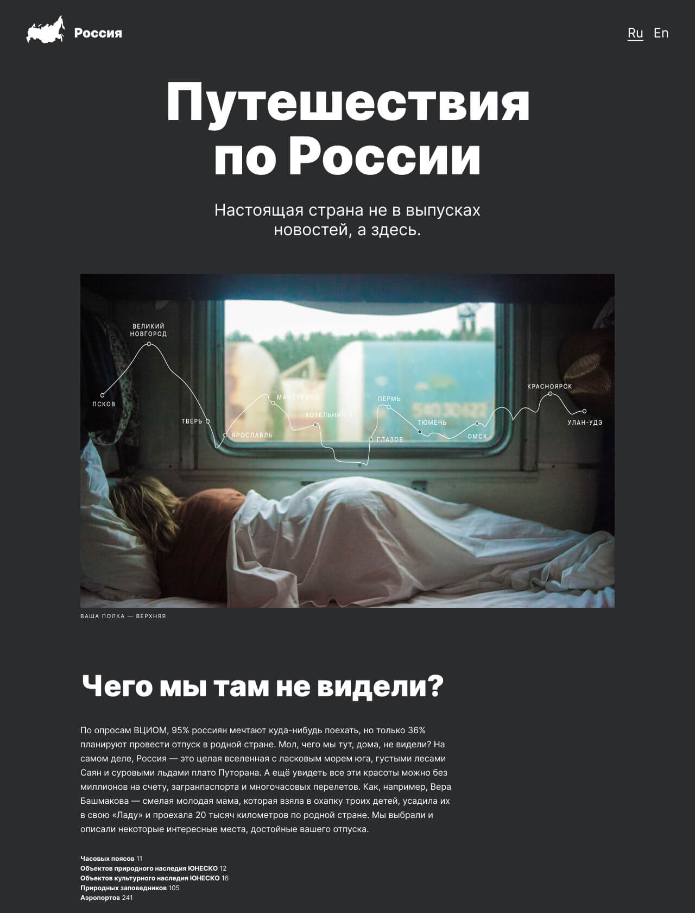

# Проектная работа: «Путешествие по России»

## Описание

Типовой лэндинг про туризм в России. Создан по макету Figma, адаптирован для просмотра на экранах различного разрешения (от 320px). 
Сайт подготовлен в рамках курса [Яндекс.Практикум](https://practicum.yandex.ru/) факультета [«Веб-разработчик».](https://practicum.yandex.ru/web/)

## Технологии
* Grid Layout
* Flexbox
* БЭМ-методология
* Файловая структура БЭМ Nested
* Media queries
* Figma

## Планы по доработке
* Реализация функционала смены языка
* Добавление новых блоков

## Ссылка на проект
[Github Pages](https://mashafromrasha.github.io/russian-travel/)

## Чеклист
[Чеклист проектной работы](https://code.s3.yandex.net/web-developer/checklists-pdf/new-program/checklist-3.pdf)

## Демо
